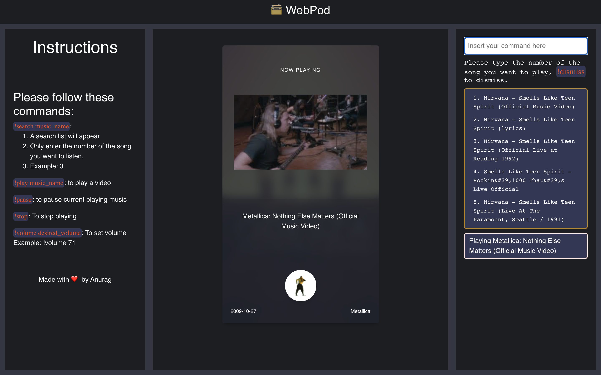

# Webpod



[](https://github.com/RichardLitt/standard-readme)


A Web App to play distraction free music.

## Table of Contents

- [webpod](#webpod)
  - [Table of Contents](#table-of-contents)
  - [Instructions](#insuctions)
  - [Install](#install)
  - [Usage](#usage)
    - [`npm start`](#yarn-start)
    - [`npm test`](#yarn-test)
    - [`npm build`](#yarn-build)
  - [API](#api)
  - [Maintainers](#maintainers)
  - [Contributing](#contributing)
  - [License](#license)

## Instructions:

-!search music_name: - A search list will appear - Only enter the number of the song you want to listen. - Example: 3
-!play music_name - to play a music
-!pause - to pause current playing music
-!stop - to stop playing
-!volume desired_volume - To set volume - Example: !volume 71

## Background

## Install

In the project directory, run:

```
npm install
```

## Usage

You need to create your own API credential on [Google Developer Console](https://console.developers.google.com/apis/credentials).
Rename .env.sample to .env and replace API_KEY value to your API Key.

In the project directory, you can run:

### `npm start`

Runs the app in the development mode.<br />
Open [http://localhost:3000](http://localhost:3000) to view it in the browser.

The page will reload if you make edits.<br />
You will also see any lint errors in the console.

### `npm build`

Builds the app for production to the `build` folder.<br />
It correctly bundles React in production mode and optimizes the build for the best performance.

The build is minified and the filenames include the hashes.<br />
Your app is ready to be deployed!

See the section about [deployment](https://facebook.github.io/create-react-app/docs/deployment) for more information.

## Maintainers

[@anuragbhattacharjee](https://github.com/anuragbhattacharjee)

## Contributing

See [the contributing file](contributing.md)!

PRs accepted.

## License

MIT © 2020 Anurag Bhattacharjee
